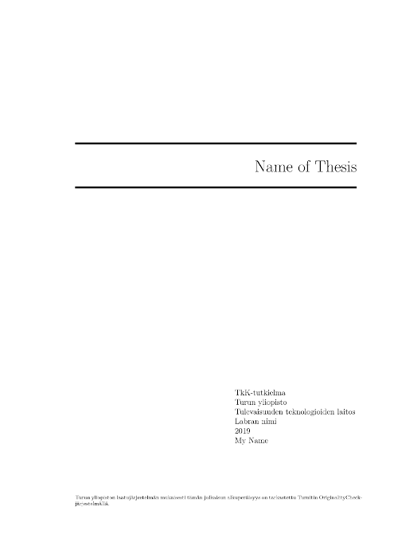

# A template for BSc / MSc theses

Document template suitable for use as a LaTeX master-file for bachelor's /
master's thesis in University of Turku Department of Future Technologies.
Merge requests are welcome - if you find an issue, [please report to us](issues/new).

Compatible with: ShareLaTeX, pdfLaTeX, LuaLaTeX, XeLaTeX, LyX, latexmk.

## Main menu

 * [Docker build environment](web/docker.md): read this if you want to generate
   the document locally using Docker or use a Git service (Gitlab / Github)
   for CI/CD.

 * [LaTeX virtual machine](web/vm.md): read this if you want to write the
   document locally using the preconfigured virtual machine (VM) or
   USB distribution provided by the Department of Future Technologies.
   The distribution provides: Debian stable, TeX Live, LyX, Pandoc,
   TeX editors, Emacs, Vim, Pygments, Seafile, Chromium, Docker.

 * [Using UTU ShareLaTeX](web/sharelatex.md): read this if you want to write
   the document in the cloud using the real-time collaborative ShareLaTeX
   service hosted by University of Turku.

 * [Using the thesis template](web/config.md): **you should read this**.
   Contains information on using and setting up the template.
   
 * [PDF/A configuration](web/pdfa.md): **you should read this**.
   Contains information on configuring the PDF/A settings.
 

## Extra features

- Should a required package be missing, see http://www.ctan.org/ 
- Consultation of the manuals of these packages is strongly encouraged 

### R and LaTeX

- https://www.tidyverse.org/
- https://ggplot2.tidyverse.org/
- https://yihui.name/knitr/
- https://joshldavis.com/2014/04/12/beginners-tutorial-for-knitr/
- https://gitlab.utu.fi/jmjmak/knitr-examples

### Tools for benchmarking

- https://github.com/sharkdp/hyperfine
- https://github.com/Gabriel439/bench

### Including source code

- https://ctan.org/pkg/minted (preferred)
- https://ctan.org/pkg/listingsutf8 (does not support full unicode)
- https://ctan.org/pkg/sverb (still relevant?)

## Miscellaneous

- Report bugs via https://gitlab.utu.fi/ttweb/thesis/issues
- LaTeX tutorial: http://www.ctan.org/tex-archive/info/lshort/english/lshort.pdf
- Overleaf tutorials: https://www.overleaf.com/learn/latex/Tutorials
