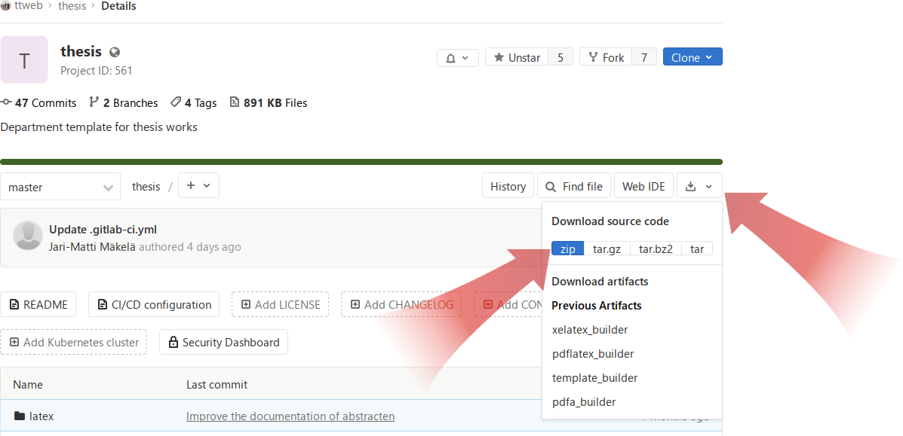
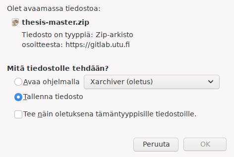
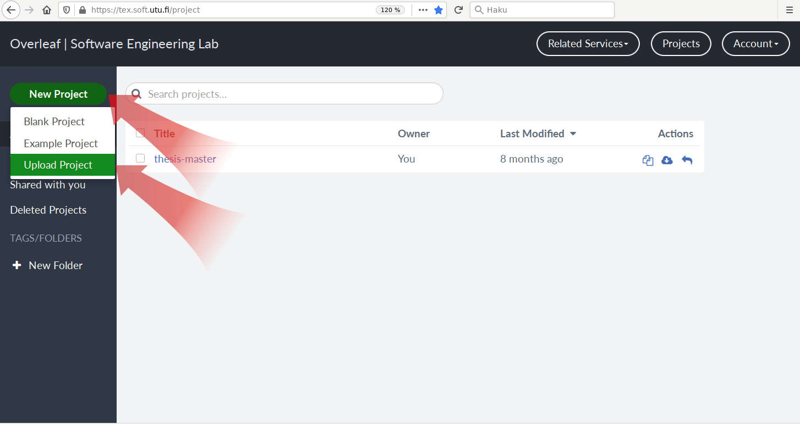
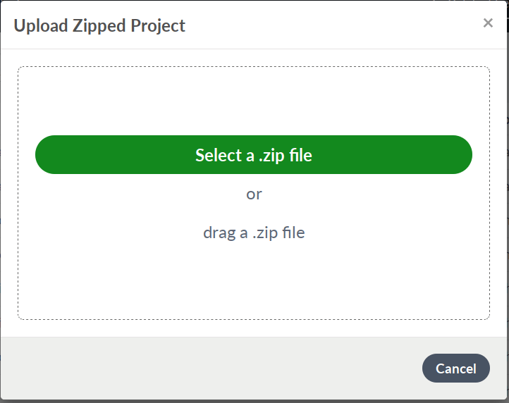
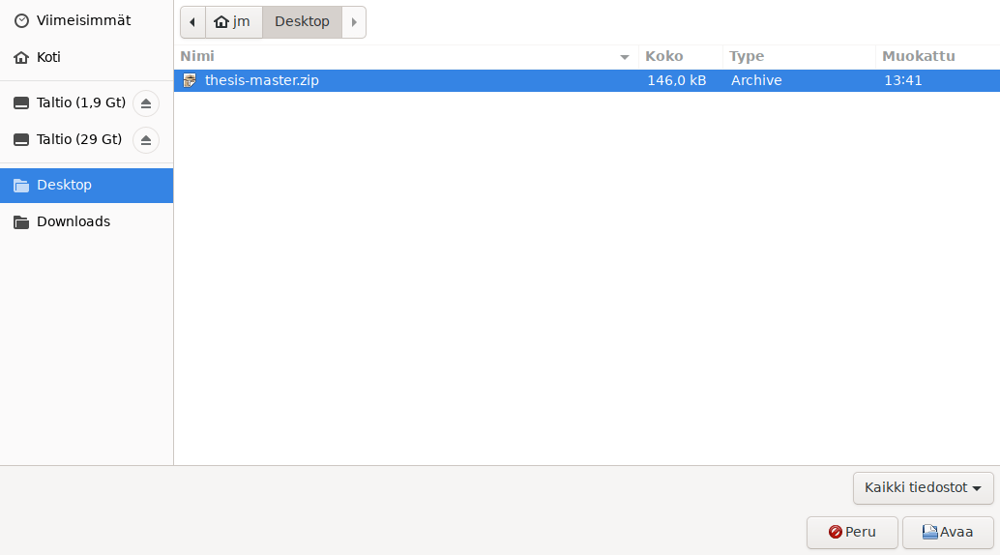
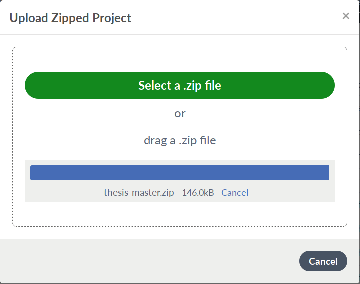
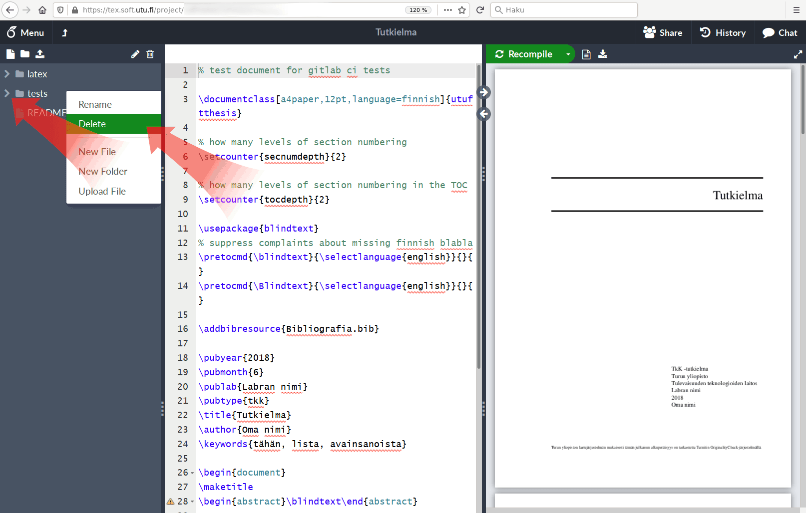
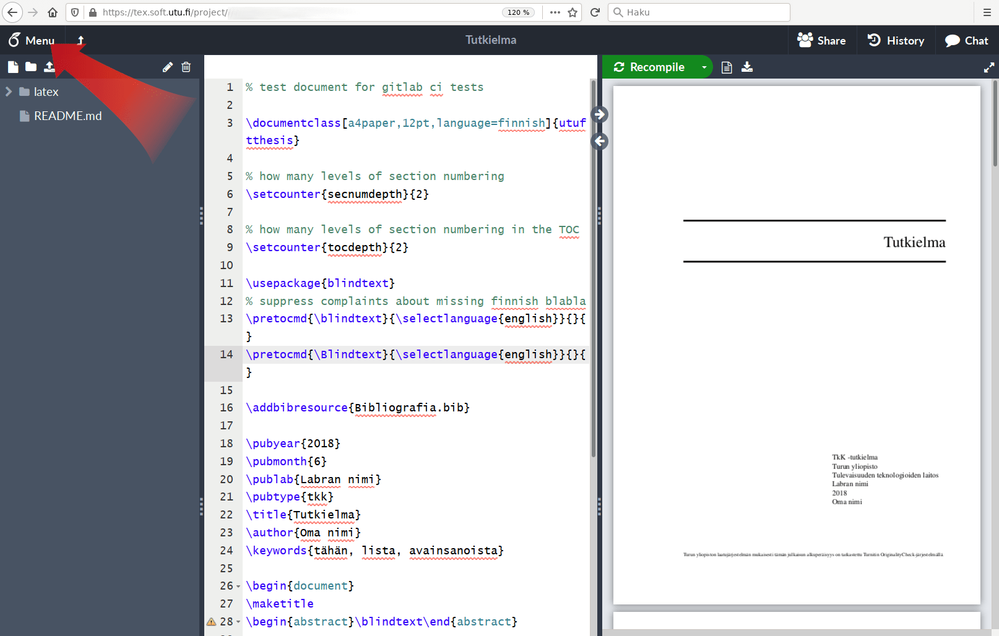
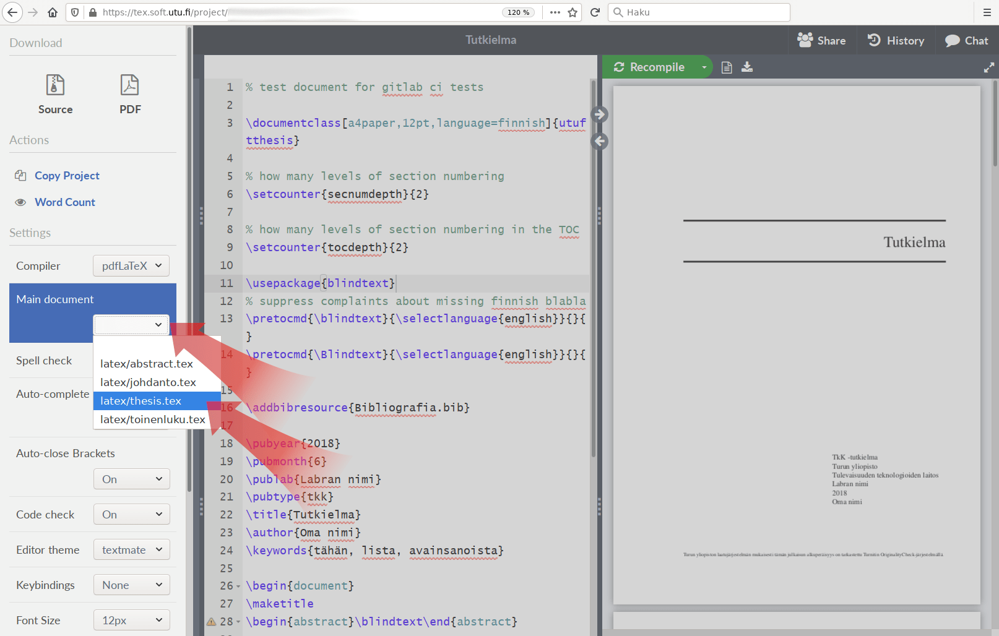
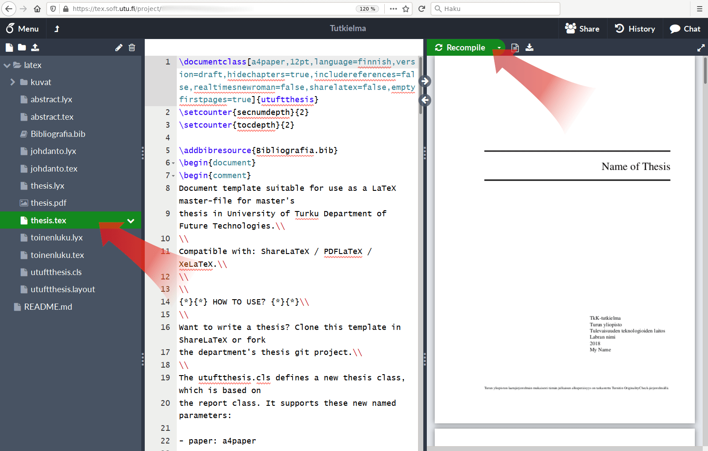

# Setting up ShareLaTeX

A ShareLaTeX platform is hosted on-premises at UTU Software Engineering Laboratory: https://tex.soft.utu.fi/

Press register at the top right corner to register for the service.

See the general LaTeX document guide for configuring the template.

The following set of screenshots describes the process of exporting the 
thesis template from the Gitlab to ShareLaTeX (exporting to Overleaf
differs slightly, but this instruction can be applied):

## Step 1: export the project

## Step 2: store the zip file locally

## Step 3: create a new ShareLaTeX project

## Step 4: use the zip (step 2) as project template

## Step 5: delete the tests folder

## Step 6: set up the main TeX document

## Step 7: recompile using the new main document

## Done
